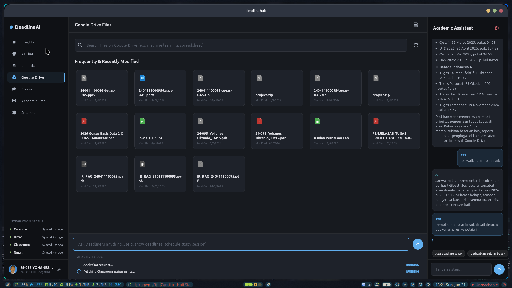

# DeadlineHUB
"Stay in 'kamu adalah mahasiswa' commands."

Selamat datang di DeadlineHUB, benteng pertahanan terakhir IPK dan kesehatan mental mahasiswa dari kepungan tugas kuliah. Project ini dibuat khusus buat kalian yang menganut sekte "menunda adalah seni" dan mendewakan sistem kebut semalam (SKS).

Aplikasi ini menyatukan Google Classroom, Google Drive, Google Calendar, dan Gmail dalam satu panel yang minimalis. Biar kelihatan sibuk coding, padahal cuma mau ngecek tugas apa saja yang belum dikumpul.
gy --conversation=23512153-448f-4b58-9240-64a13f0678c7
---

## Tampilan Aplikasi
Berikut adalah preview dari aplikasi DeadlineHUB:



---

## Fitur Utama

### AI Smart Calendar dan Weekly Planner
*   **Masalah:** Malas input jadwal belajar manual?
*   **Solusi:** Ketik langsung pakai bahasa santai seperti "Belajar ML nanti malam jam 8" di kolom AI Schedule Creator. AI akan otomatis menyusun draf jadwal belajar Anda.
*   **Perbaikan Bug Jam:** Kami sudah memperbaiki bug legendaris di mana input jam 8 malam malah bergeser jadi jam 1 subuh karena bentrok timezone UTC/WIB. Sekarang waktu berjalan sesuai zona waktu lokal perangkat Anda.
*   **Edit dan Hapus:** Draf jadwal bisa diubah atau dihapus sesuka hati sebelum Anda putuskan untuk sinkronisasi ke Google Calendar asli.

### Google Classroom (Tanpa Ikon, Langsung Teks)
*   **Tombol Berbasis Teks:** Sesuai permintaan, tidak ada ikon membingungkan di bagian Classroom. Semua navigasi diganti menggunakan tombol teks yang jelas.
*   **Buka Link:** Klik tombol "Buka" untuk langsung membuka link tugas asli di browser eksternal.
*   **Tandai Selesai secara Lokal:** Klik tombol "Selesai" untuk menandai tugas tersebut beres. Tugas akan langsung disembunyikan dari daftar untuk menjaga kedamaian pikiran Anda.

### AI Email Summary (Bebas Freeze)
*   **Masalah:** Email dari kampus panjangnya mirip skripsi?
*   **Solusi:** Klik emailnya, dan AI akan merangkum isi email menjadi satu kalimat padat berisi poin penting atau deadline.
*   **Bebas Crash:** Logika popup dialog sudah ditulis ulang memakai FutureBuilder. Tidak ada lagi masalah aplikasi membeku atau crash navigator locked saat loading ringkasan email.

### Google Drive Integration
*   Rekomendasi otomatis untuk file materi di Google Drive yang paling relevan dengan deadline tugas terdekat Anda.

---

## Cara Menjalankan Project

Jika ingin mencoba project ini di perangkat lokal:

1.  Pastikan Flutter SDK sudah terinstall di komputer Anda.
2.  Masuk ke direktori project:
    ```bash
    cd deadlinehub
    ```
3.  Jalankan perintah untuk mengambil dependensi:
    ```bash
    flutter pub get
    ```
4.  Jalankan aplikasi ke perangkat atau simulator:
    ```bash
    flutter run
    ```

---

## Catatan
Aplikasi ini tidak menjamin Anda mendapatkan nilai A otomatis, tapi setidaknya membantu Anda memantau tugas dengan lebih tenang tanpa perlu panik membuka banyak tab Google Classroom sekaligus. Gunakan dengan bijak.
