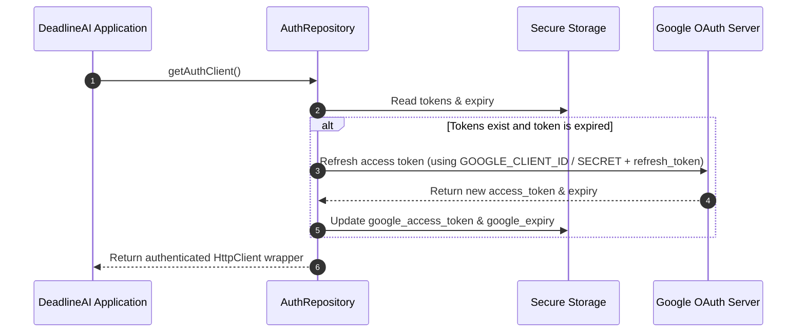

# Authentication & Security Module (auth)

DeadlineAI implements a **hybrid authentication model** designed for seamless, security-compliant desktop usage:
1. **Google OAuth credentials** are owned by the application developer and loaded through host environment configuration (`GOOGLE_CLIENT_ID` and `GOOGLE_CLIENT_SECRET`).
2. **Gemini API Key** is provided by the user and stored securely on their local device.

Under this model, users do not need to create Google Cloud projects or provide developer secrets. They only need to continue with Google and input their personal Gemini API Key.

---

## 1. OAuth Architecture & Required Scopes

To synchronize tasks, coursework, and messages, DeadlineAI requests consent for the following scopes:
* `https://www.googleapis.com/auth/calendar` (Read, write, update, delete calendar events)
* `https://www.googleapis.com/auth/drive.readonly` (Read and search Google Drive files)
* `https://www.googleapis.com/auth/gmail.readonly` (Read academic and critical inbox messages)
* `https://www.googleapis.com/auth/classroom.courses.readonly` (Read course rosters and metadata)
* `https://www.googleapis.com/auth/classroom.coursework.me.readonly` (Read student coursework assignments)
* `openid` / `email` / `profile` (Retrieve user identity metadata)

---

## 2. Secure Storage Architecture

Developer credentials must never be written to disk. The application securely persists user tokens and API keys locally using **platform-specific secure storage APIs** (via `flutter_secure_storage`):

* **Linux**: libsecret (D-Bus Secret Service API)
* **Windows**: Credential Manager (DPAPI-based storage)
* **macOS**: Apple KeychainServices

### Stored Keys
* `google_access_token` - Current active OAuth token used to request resource servers.
* `google_refresh_token` - Long-lived offline credential used to obtain new access tokens.
* `google_expiry` - Expiry timestamp of the active access token.
* `gemini_api_key` - User's personal Gemini AI Studio API Key.

---

## 3. Onboarding & Authentication Flow

When the application launches, it triggers the **First Launch Experience** check:
1. **Load Secure Storage**: Reads access tokens, refresh tokens, expiry details, and the Gemini API Key.
2. **Google Session Exists**: Verifies whether cached Google credentials exist.
3. **Gemini Key Exists**: Verifies whether a Gemini API Key exists.
4. **Validate Google Session**: Verifies active session by checking token validity.
5. **Validate Gemini Key**: Validates the Gemini key by issuing a test generation request to Google Generative AI servers.
6. **Open Main Application**: If all steps succeed, it bypasses the onboarding screen.

If any requirement is missing or fails verification, the **Authentication Guard** is activated, presenting the 3-step setup UI:

* **Step 1: Google Account**
  * Clicking "Continue with Google" launches a local loopback server and opens the system browser to prompt user authorization using developer credentials.
  * Captures the redirected authorization code, exchanges it for credentials, and securely stores the access/refresh tokens and expiry information.
* **Step 2: Gemini API Key**
  * Prompts the user to enter their key (hidden by default with reveal/paste actions).
  * Validates the key immediately by requesting content generation from `gemini-1.5-flash` model.
  * Saves to local secure storage if successful.
* **Step 3: Start Application**
  * This button is only enabled when both Google and Gemini integration steps succeed.
  * Clicking it activates the main application.

---

## 4. Session Lifecycle & Token Refresh Flow

The session lifecycle is maintained reactively through Riverpod providers:



1. **Auto-refreshing HttpClient**: Repository methods obtain an authenticated `AuthClient` which automatically updates the stored credentials upon background token refreshes.
2. **Global Auth Guard**: An auth gate notifier monitors `authStateChanges`. If authentication becomes invalid or revoked, or if the refresh token expires, the application immediately blocks access and displays the full-screen authentication screen.

---

## 5. Gemini API Key Validation Flow

To guarantee that the application never runs with invalid keys, the validation workflow behaves as follows:

1. Send test generation request:
   ```dart
   final model = GenerativeModel(
     model: 'gemini-1.5-flash',
     apiKey: apiKey,
   );
   final response = await model.generateContent([Content.text('Hello')]);
   final isValid = response.text != null;
   ```
2. If `isValid` is true: Save key to secure storage and flag integration as connected.
3. If `isValid` is false or throws an API exception: Reject the input, present the validation error message in the UI, and prevent setup completion.
